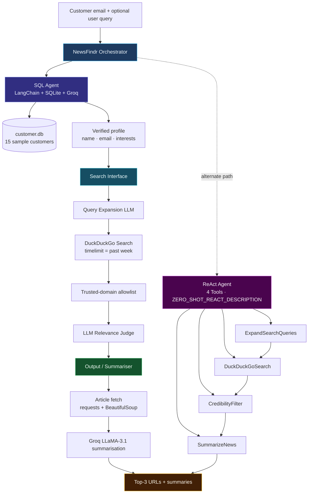
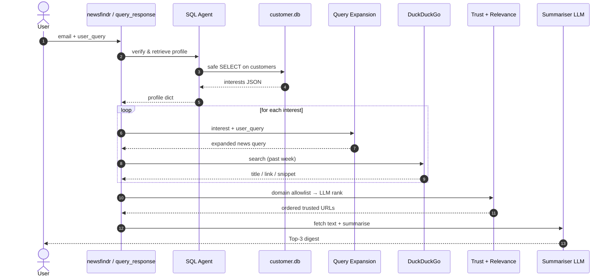
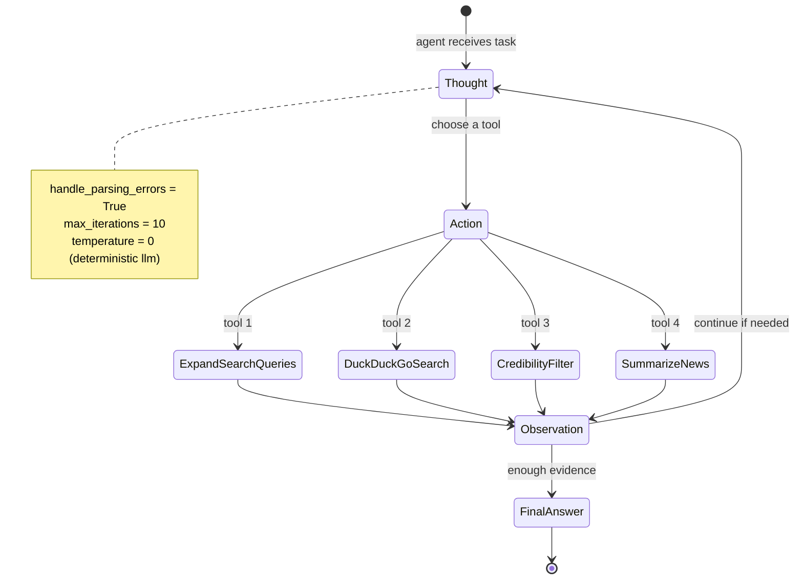
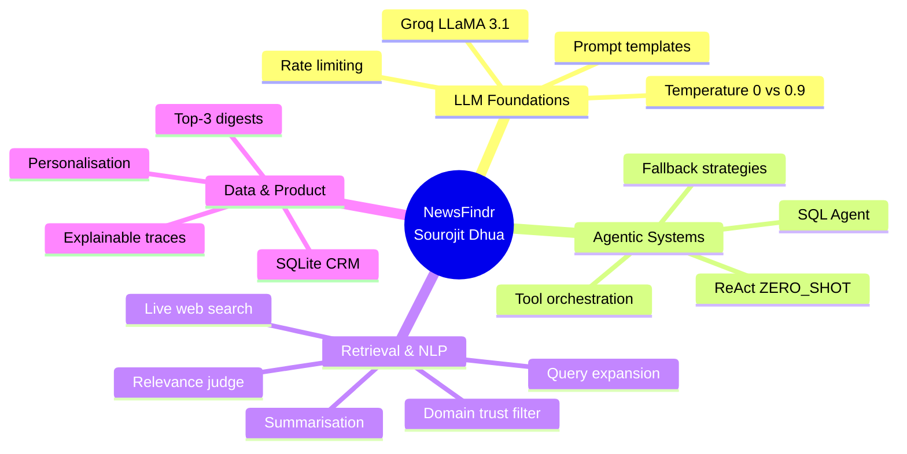
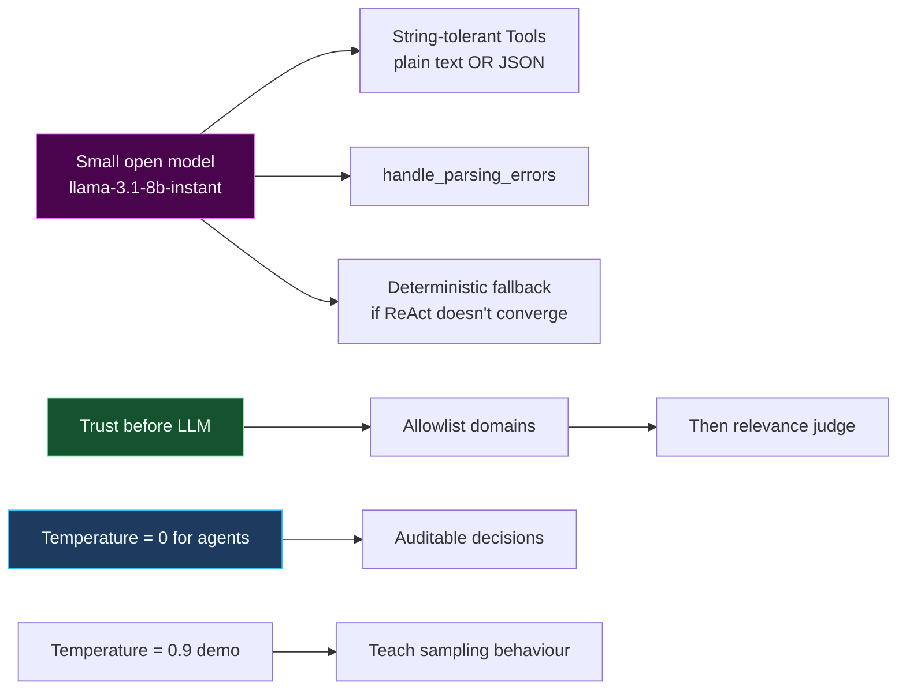

<!--
  NewsFindr — Agentic AI for Personalized News Retrieval
  Author: Sourojit Dhua
-->

<!-- Animated typing banner -->

 

<!-- Identity / stack badges -->

  

  

**An end-to-end multi-agent system that turns a customer email into a curated, trustworthy news digest — built and documented by [Sourojit Dhua](https://github.com/sourojitd).**

 

  

[**Live showcase**](https://sourojitd.github.io/AIML-NewsFindr/) · [Notebook](#-repository-contents) · [Architecture](#-system-architecture) · [AIML Topics](#-aiml-topics-demonstrated) · [Pipeline](#-end-to-end-data-flow) · [Run](#-quick-start)

---

## Overview

Modern readers drown in volume and starve for signal. **NewsFindr** closes that gap with an **agentic GenAI pipeline**:

1. Verify a customer in a relational CRM (`customer.db`)
2. Expand their interests (+ optional free-text query) into precise news searches
3. Retrieve **fresh** results from the open web (DuckDuckGo, past week)
4. Keep only **trusted publishers**, then LLM-rank for relevance
5. Fetch article text and produce concise per-URL summaries
6. Return a **Top-3** personalised digest

The same capabilities are exposed two ways:

| Mode | Entry point | Why it matters |
|---|---|---|
| **Deterministic pipeline** | `newsfindr()` / `query_response()` | Auditable, reproducible, rate-limit friendly |
| **True ReAct agent** | `initialize_agent` + `ZERO_SHOT_REACT_DESCRIPTION` | Autonomously chooses *when* and *in what order* to call tools |

> Developed as an **Advanced GenAI for NLP** project by **Sourojit Dhua**, covering LLM ops, SQL agents, tool-calling, credibility filtering, and ReAct orchestration end to end.

---

## What problem it solves

**Business objectives covered in the notebook**

- Real-time, personalised discovery from verified customer interests
- Credibility via a curated publisher allowlist before the LLM ever judges content
- Reduced overload through freshness filters, deduplication, and Top-3 ranking
- Explainable orchestration (pipeline traces + verbose ReAct tool calls)

---

## System architecture

### Dual LLM clients (temperature as a design choice)

| Client | Temperature | Role |
|---|---|---|
| `llm` | **0.0** | Deterministic workhorse — SQL, expansion, relevance, summarisation, ReAct |
| `llm_high` | **0.9** | Creative contrast — same prompt yields varied taglines (pedagogical demo) |

Model: **`llama-3.1-8b-instant`** on **Groq** (low latency + tool-calling), with a shared `InMemoryRateLimiter` for free-tier safety.

---

## End-to-end data flow

---

## ReAct agent loop

Four LangChain `Tool`s are bound to a **ZERO_SHOT_REACT_DESCRIPTION** agent. The model plans with Thought → Action → Observation until a Final Answer (or a graceful fallback to the deterministic pipeline).

---

## AIML topics demonstrated

This repository is structured to show depth across the GenAI / NLP stack — not just “call an API”.

<b>Click to expand the skills map</b>

 

| Area | What Sourojit implemented | Where |
|---|---|---|
| **LLM Ops** | Groq `ChatGroq`, dual temperatures, rate limiting, retries, `.env` secrets | §1 |
| **Prompt Engineering** | System prefixes, structured JSON outputs, editor / judge / summariser personas | §2–4 |
| **SQL Agents** | `create_sql_agent`, read-only SELECT constraints, NL → SQL, negative email tests | §2 |
| **Hybrid retrieval** | Deterministic SQL helper + agent path for speed vs explainability | §2.4 |
| **Query understanding** | Interest → expanded news query + free-text `user_query` blending | §3.1 |
| **Web RAG-lite** | DuckDuckGo live search, freshness (`timelimit="w"`), snippet normalisation | §3.2 |
| **Trust & safety** | Curated publisher allowlist before LLM scoring (misinformation control) | §3.3 |
| **LLM-as-judge** | Relevance ranking over candidate articles | §3.4 |
| **Content extraction** | `requests` + BeautifulSoup with snippet fallback | §4.1 |
| **Summarisation** | Per-URL concise digests grounded in fetched text | §4 |
| **Pipeline design** | Dedup by URL/domain, Top-N selection, verbose audit trail | §4.2 |
| **Tool calling** | Four string-tolerant Tools for small-model robustness | §5.1 |
| **ReAct agents** | `initialize_agent`, intermediate steps, parse-error recovery, fallback | §5.2–5.3 |
| **Evaluation demos** | Three customers × distinct queries (Kevin, Julia, Alice) | §6 |
| **Engineering hygiene** | `requirements.txt`, idempotent DB seed, HTML export of executed notebook | repo |

---

## Live project site

Interactive public page (pipeline explorer, topic deep-dives, temperature demo, animations):

**https://sourojitd.github.io/AIML-NewsFindr/**

Source lives in [`docs/`](./docs) and is served via GitHub Pages.

## Repository contents

| File | Purpose |
|---|---|
| `NewsFindr.ipynb` | Main executed notebook (primary deliverable) |
| `NewsFindr.html` / `Sourojit_NewsFindr.html` | Static HTML render of the notebook |
| `docs/` | GitHub Pages showcase site |
| `README.md` | Project brief |
| `customer.db` | Input CRM data — SQLite with 15 customers |

### About `customer.db`

**Yes — `customer.db` is the project’s input data file.** You should upload it.

It stores the sample CRM the SQL agent queries:

| Column | Meaning |
|---|---|
| `customer_id` | Stable business key |
| `name` | Display name |
| `email` | Lookup key for personalisation |
| `interests` | JSON list of topics (e.g. Politics, Startups, Travel) |
| `last_updated` | Timestamp |

The notebook can also recreate/seed this DB idempotently (`INSERT OR IGNORE`), but shipping the file makes the demo one-command runnable for reviewers.

---

## Quick start

1. Clone the repo and open `NewsFindr.ipynb` in Jupyter / VS Code.
2. Create a local `.env` with `GROQ_API_KEY=...` (never commit this file).
3. Run all cells — the notebook installs its own dependencies in the setup section.

View the static walkthrough anytime via `Sourojit_NewsFindr.html`, or the interactive site at [sourojitd.github.io/AIML-NewsFindr](https://sourojitd.github.io/AIML-NewsFindr/).

---

## Example queries exercised

| Customer | Interests | User query |
|---|---|---|
| **Kevin** | Politics, Startups, Travel | *latest developments this week* |
| **Julia** | India, Automobile, Business | *electric vehicles and the Indian economy* |
| **Alice** | Politics, Technology, Business | *AI regulation and big tech* |

Each run verifies email → retrieves interests → blends the free-text query → searches → filters → summarises → returns **Top-3**.

---

## Design decisions that show engineering judgment

- **Trust gate before the LLM** — domain allowlist removes unverified publishers cheaply; the model only ranks survivors.
- **Two orchestration styles** — pipeline for production-like reproducibility; ReAct for agentic autonomy.
- **Rate-limit awareness** — shared limiter + retries so free-tier Groq stays usable during demos.
- **Graceful degradation** — article fetch failures fall back to search snippets; agent non-convergence falls back to `newsfindr()`.

---

## Project rubric coverage

| # | Criteria | Status |
|---|---|---|
| 1 | Setting Up the LLM (install, Groq load, simple query, temperature demo) | Completed |
| 2 | SQL Agent for Data Retrieval | Completed |
| 3 | Interface Between SQL and Search Agents | Completed |
| 4 | Output from LLMs (URLs + summaries) | Completed |
| 5 | Creating the Agent (Tools + ReAct) | Completed |
| 6 | Querying with the Agent (3 example users) | Completed |
| 7 | Conclusion | Completed |

---

## Author

### Sourojit Dhua

**Advanced GenAI · NLP · Agentic Systems · LangChain · Groq**

Built **NewsFindr** as a full-stack demonstration of modern AIML practice:  
relational grounding → live retrieval → trust filtering → tool-using agents → grounded summarisation.

If this README or notebook helped you learn agentic NLP patterns, a star is appreciated.

---

